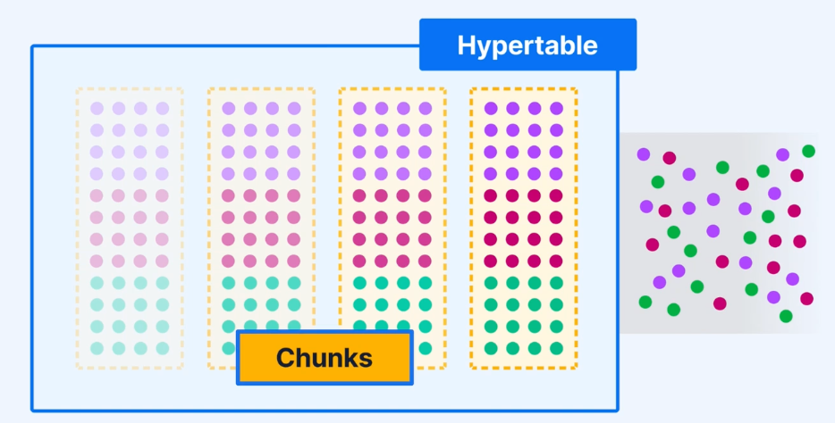
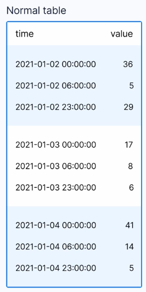
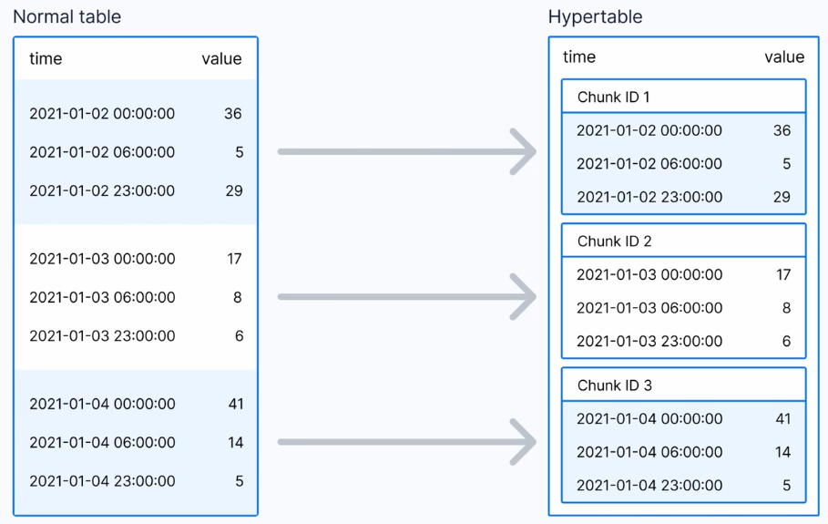

## TimescaleDB
## reference
- https://www.youtube.com/watch?v=MpMw7yIjauI

## architecture

### normal table

### hypertable

## introduction
- Hypertable -> normal table in PostgresSQL
- automatic time (space) partitioning
- extra functionality
- timescaleDB self manages