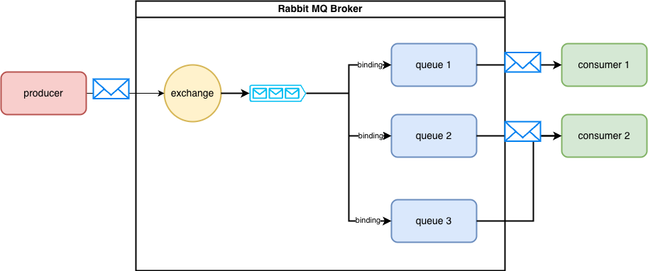

## RabbitMQ

## reference
- 

## architecture

## introduction
### exchange
- when a data sender sends data to RabbitMQ, the data must be sent to the Exchange
- So the data is not sent directly to the data recipient, but is first received at the Exchange
### queue
- A Queue (queue) is a place to store data received by the Exchange
- An Exchange is like a gateway for receiving data. The Exchange will then forward the received data to the Queue